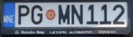
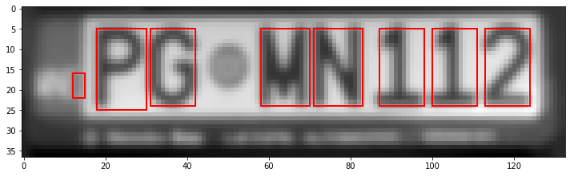

# License Plate Character Segmentation and Recognition

Implemented a connected component analysis based algorithm for character localization and segmentation in license plate images using Python and Skimage. Used Python and Keras-OCR for recognizing segmented characters.

| Original Image | Segmentation using Connected Component Analysis | Recognized Text |
| ------ | ------ | ------ |
|  |  | p g m n 1 1 2 |
